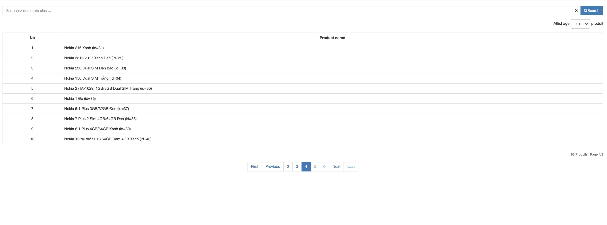
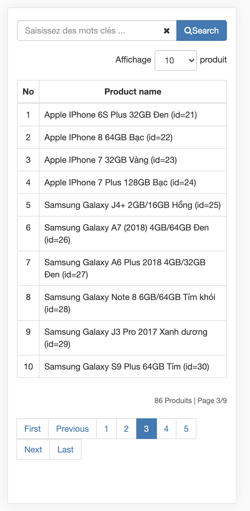

# Getting Started with Create React App

This project was bootstrapped with [Create React App](https://github.com/facebook/create-react-app).

## Example How TO - Filter/Search List

https://www.w3schools.com/howto/tryit.asp?filename=tryhow_js_filter_list

## Available Scripts

In the project directory, you can run:

### `yarn start`

### `screenShot`

